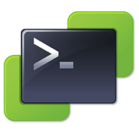

# Container Image for VMware PowerCLI on PowerShell Core

## Overview

Provides a container image for running VMware PowerCLI and supporting modules.

This image includes the following components:

| Component                          | Description                                                                     |
|------------------------------------|---------------------------------------------------------------------------------|
| Microsoft PowerShell Core          | A cross-platform automation and configuration tool/framework.                   |
| `VMware.PowerCLI`                  | A collection of PowerShell modules for managing and automating VMware products. |
| `VMware.vSphere.SsoAdmin`          | PowerShell module for vCenter Single Sign-on.                                   |
| `PowerVCF`                         | PowerShell module for VMware Cloud Foundation API.                              |
| `PowerValidatedSolutions`          | PowerShell module for VMware Validated Solutions.                               |
| `VMware.PowerManagement`           | PowerShell module for power management of VMware Cloud Foundation.              |
| `VMware.CloudFoundation.Reporting` | PowerShell module for VMware Cloud Foundation reporting.                        |

## Package Versions

<!-- snip -->
| Package | Version |
|---------|---------|
